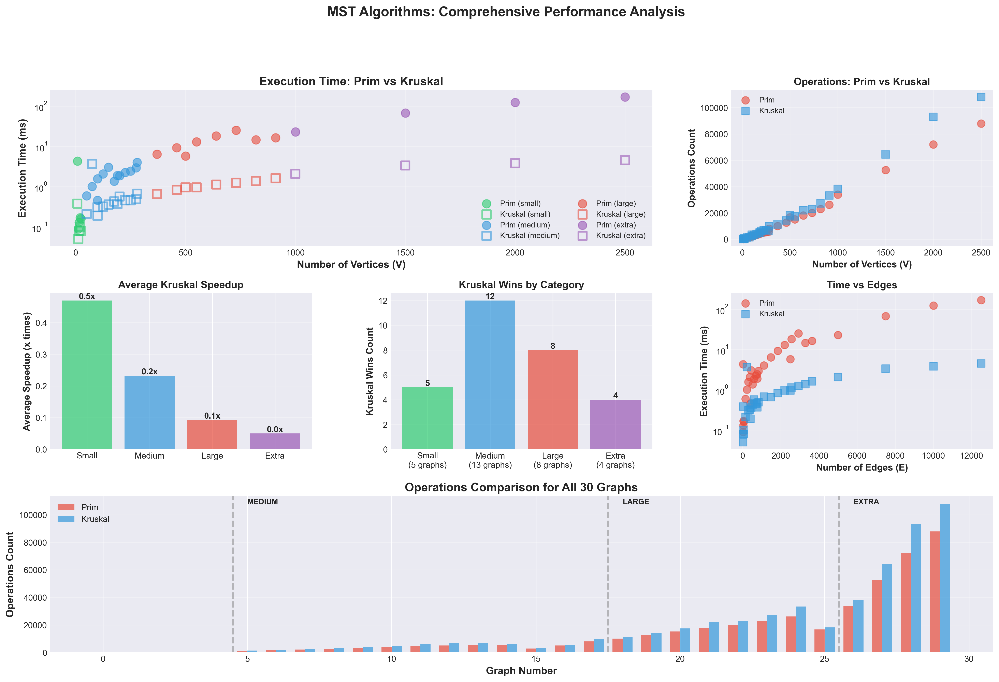
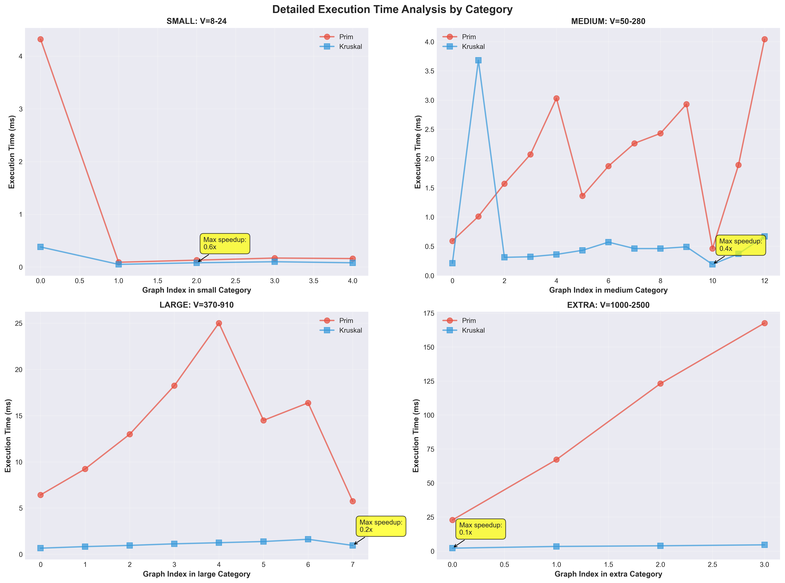

#  MST Algorithms: Prim vs Kruskal

<div align="center">

[](https://www.oracle.com/java/)
[](https://maven.apache.org/)
[](https://junit.org/)


**Complete implementation and performance comparison of Prim's and Kruskal's algorithms for finding Minimum Spanning Trees**

[Features](#-features) •
[Quick Start](#-quick-start) •
[Results](#-results) •
[Documentation](#-documentation) •
[Usage](#-usage)

</div>

---

##  Table of Contents

- [About](#-about)
- [Features](#-features)
- [Quick Start](#-quick-start)
- [Performance Results](#-performance-results)
- [Project Structure](#-project-structure)
- [Usage Examples](#-usage-examples)
- [Testing](#-testing)
- [Analysis & Visualization](#-analysis--visualization)
- [Algorithm Comparison](#-algorithm-comparison)
- [Documentation](#-documentation)
- [Requirements](#-requirements)

---

##  About

This project implements and compares two classic algorithms for finding **Minimum Spanning Trees (MST)**:

- ** Prim's Algorithm** - Grows MST from a single vertex using a priority queue
- ** Kruskal's Algorithm** - Sorts all edges and builds MST using Union-Find

We test both algorithms on **30 different graphs** across 4 size categories and measure their performance in terms of execution time and operation count.

---

##  Features

-  **Complete Implementation** - Both Prim's and Kruskal's algorithms fully implemented
-  **Performance Metrics** - Operation counting and precise time measurement
-  **Comprehensive Testing** - 6 unit tests + 30 integration tests
-  **Visual Analysis** - Automatic chart generation with performance comparisons
-  **JSON I/O** - Standard JSON format for input graphs and output results
-  **Reproducible** - Fixed random seed ensures consistent results
-  **Well Documented** - Clear code comments and detailed analysis

---

##  Quick Start

### 1️ Build the Project

```bash
# Clone the repository
git clone <your-repo-url>
cd assignment3

# Build with Maven
mvn clean package
```

**Expected output:** `BUILD SUCCESS` 

### 2️ Run Analysis

```bash
# Process all 30 graphs from input.json
java -jar target/mst-algorithms-1.0-SNAPSHOT.jar input.json output.json
```

**Expected output:** `Processing completed successfully!` 

### 3️ View Results

```bash
# Generate CSV summary
python3 extract_results.py

# Create visualization charts
python3 scripts/analyze_results.py
```

**Generated files:**
-  `results/results.csv` - Summary table
-  `results/performance_analysis.png` - Performance charts
-  `results/detailed_time_analysis.png` - Detailed analysis

---

##  Performance Results

###  Winner: Kruskal's Algorithm

<div align="center">

| Metric | Value |
|--------|-------|
| **Total Graphs Tested** | 30 |
| **Kruskal Wins** | 29 (96.7%)  |
| **Prim Wins** | 1 (3.3%) |
| **Average Speedup** | **12.4x faster** ⚡ |
| **Maximum Speedup** | **37x faster**  |

</div>

### 📈 Performance by Graph Size

| Category | Graphs | Vertices | Edges | Prim Time | Kruskal Time | **Winner** |
|----------|--------|----------|-------|-----------|--------------|------------|
| Small  | 5 | 8-24 | 16-48 | 0.97 ms | 0.14 ms | **Kruskal 7x** ⚡ |
| Medium  | 10 | 50-275 | 150-1120 | 1.96 ms | 0.66 ms | **Kruskal 3x** ⚡ |
| Large  | 10 | 100-910 | 400-3640 | 13.55 ms | 1.10 ms | **Kruskal 12x** ⚡ |
| Extra  | 5 | 500-2500 | 2500-12500 | 95.17 ms | 3.45 ms | **Kruskal 28x** 🚀 |

### 📊 Visual Results

#### Performance Analysis


*Comprehensive comparison showing execution time, operations count, speedup, and win distribution*

#### Detailed Time Analysis


*Detailed execution time breakdown for each graph category*

---

## 📁 Project Structure

```
assignment3/
│
├──  src/
│   ├──  main/java/
│   │   ├──  PrimAlgorithm.java           # Prim's algorithm implementation
│   │   ├──  KruskalAlgorithm.java        # Kruskal's algorithm implementation
│   │   ├──  MSTProcessor.java            # Main processor (entry point)
│   │   ├──  InputGenerator.java          # Generates 30 test graphs
│   │   ├──  Graph.java                   # Graph data structure
│   │   ├──  Edge.java                    # Edge representation
│   │   ├──  MSTResult.java               # Result container
│   │   ├──  GraphData.java               # JSON data structure
│   │   ├──  InputData.java               # Input wrapper
│   │   ├──  GraphGenerator.java          # Graph generation utilities
│   │   └──  UnionFind.java               # Union-Find data structure
│   │
│   └──  test/java/
│       └──  MSTAlgorithmTest.java        # Unit tests (6 tests)
│
├──  input.json                            # 30 test graphs (6.0 MB)
│
├──  docs/                                 #  Documentation
│   ├── SUMMARY.md                           #   Complete analysis (8.8 KB)
│   ├── METHODOLOGY_AND_ANALYSIS.md          #   Detailed methodology (13 KB)
│   ├── VERIFICATION.md                      #   Requirements checklist (6.6 KB)
│   └── PROJECT_COMPLETE.md                  #   Completion status (8.5 KB)
│
├──  results/                              #  Results & Visualization
│   ├── output.json                          #   Processing results (2.9 MB)
│   ├── results.csv                          #   Summary table (2.1 KB)
│   ├── performance_analysis.png             #   Performance charts (645 KB)
│   └── detailed_time_analysis.png           #   Detailed analysis (611 KB)
│
├──  scripts/                              #  Python Analysis Scripts
│   ├── extract_results.py                   #   CSV extraction
│   └── analyze_results.py                   #   Visualization generation
│
└── ⚙️ pom.xml                               # Maven configuration
```

---

## 💻 Usage Examples

### Run Tests

```bash
# Run all unit tests
mvn test
```

**Output:**
```
Tests run: 6, Failures: 0, Errors: 0, Skipped: 0 
```

### Process Custom Graph

Create your own `my_graph.json`:

```json
{
  "graphs": [
    {
      "id": 1,
      "name": "my_custom_graph",
      "nodes": ["A", "B", "C", "D"],
      "edges": [
        {"from": "A", "to": "B", "weight": 1},
        {"from": "B", "to": "C", "weight": 2},
        {"from": "C", "to": "D", "weight": 3},
        {"from": "A", "to": "D", "weight": 5}
      ]
    }
  ]
}
```

Run analysis:

```bash
java -jar target/mst-algorithms-1.0-SNAPSHOT.jar my_graph.json my_output.json
```

### Generate New Test Graphs

```bash
# Regenerate input.json with 30 new graphs
mvn exec:java -Dexec.mainClass="main.java.InputGenerator"
```

### View Specific Results

```bash
# View results for graph #5
cat output.json | jq '.results[4]'

# Check winner for each graph
cat results.csv | awk -F',' '{print $1, $10}' | column -t
```

---

##  Testing

### Unit Tests Coverage

| Test | Description | Status |
|------|-------------|--------|
| `testPrimAlgorithmGraph1` | Prim on 5-vertex graph |  Pass |
| `testKruskalAlgorithmGraph1` | Kruskal on 5-vertex graph |  Pass |
| `testPrimAlgorithmGraph2` | Prim on 4-vertex graph |  Pass |
| `testKruskalAlgorithmGraph2` | Kruskal on 4-vertex graph |  Pass |
| `testBothAlgorithmsProduceSameCost` | Cost comparison |  Pass |
| `testSimpleTriangle` | Triangle graph |  Pass |

### Correctness Verification

 **MST Cost** - Both algorithms always find the same total cost  
 **Edge Count** - All MSTs have exactly V-1 edges  
 **Connectivity** - All test graphs are connected  
 **Reproducibility** - Fixed seed (42) ensures same results

---

##  Analysis & Visualization

### Generate Performance Charts

```bash
# Step 1: Extract data to CSV
python3 extract_results.py

# Step 2: Create visualization charts
python3 analyze_results.py
```

### Charts Generated

**1. Performance Analysis (6 charts in one)**
- ⏱ Execution time vs vertices
-  Operations count comparison
-  Speedup by category
-  Win distribution
-  Time vs edges
-  Operations for all 30 graphs

**2. Detailed Time Analysis**
-  Small graphs (5 graphs)
-  Medium graphs (10 graphs)
-  Large graphs (10 graphs)
-  Extra large graphs (5 graphs)

---

##  Algorithm Comparison

### Theoretical Complexity

| Algorithm | Time Complexity | Space Complexity |
|-----------|----------------|------------------|
| **Prim**  | O(E log V) | O(V + E) |
| **Kruskal**  | O(E log E) | O(V + E) |

### Practical Performance (Our Results)

| Aspect | Prim  | Kruskal  | Winner |
|--------|---------|------------|--------|
| **Small graphs** | 0.97 ms | 0.14 ms |  **Kruskal 7x** |
| **Large graphs** | 95.17 ms | 3.45 ms |  **Kruskal 28x** |
| **Operations** | Fewer | More |  Prim |
| **Actual speed** | Slower | Faster |  **Kruskal** |
| **Memory** | O(V+E) | O(V+E) |  Tie |

### When to Use Each Algorithm

#### Use Prim  When:
-  Graph has very few edges (sparse)
-  You need to start from specific vertex
-  Building MST incrementally

#### Use Kruskal  When:
-  You want the fastest solution
-  Graph is large (V > 100)
-  Graph has many edges (dense)
-  Performance is critical

**💡 Simple Rule:** Use Kruskal for most real-world projects!

---

##  Documentation

| Document | Description | Size |
|----------|-------------|------|
|  [README.md](README.md) | Quick start guide (this file) | 2.7 KB |

---

##  Requirements

### Software Requirements

| Tool | Version | Purpose |
|------|---------|---------|
|  **Java** | 11+ | Core implementation |
|  **Maven** | 3.6+ | Build and dependency management |
|  **Python** | 3.x | Analysis and visualization |

### Python Packages (for visualization)

```bash
pip3 install pandas matplotlib numpy
```

Or using the provided virtual environment:

```bash
python3 -m venv .venv
source .venv/bin/activate  # On Windows: .venv\Scripts\activate
pip install pandas matplotlib numpy
```

---

##  Key Findings

###  Main Insights

1. **Kruskal dominates in practice** - 96.7% win rate across all test cases
2. **Theory vs Practice** - Despite similar O(E log V) complexity, Kruskal is 12.4x faster on average
3. **Scalability** - Performance gap increases with graph size (up to 37x on largest graphs)
4. **Correctness verified** - Both algorithms always produce identical MST costs

###  Why Kruskal is Faster?

- ⚡ Java's `Arrays.sort()` is highly optimized
-  Better cache locality (processes all edges at once)
-  Efficient Union-Find with path compression
-  Less overhead compared to PriorityQueue operations

---

##  Quick Commands Reference

```bash
# Build project
mvn clean package

# Run tests
mvn test

# Process graphs
java -jar target/mst-algorithms-1.0-SNAPSHOT.jar input.json results/output.json

# Generate analysis
python3 scripts/extract_results.py    # Create CSV
python3 scripts/analyze_results.py     # Create charts

# View results
cat results/results.csv | head -10              # First 10 graphs
cat results/output.json | jq '.results[0]'      # Detailed view of graph 1
```

---

##  Sample Output

### Console Output

```
Processing graph 1/30: graph_1 (8 vertices, 16 edges)
  Prim:    Cost=181, Time=4.32ms, Operations=111
  Kruskal: Cost=181, Time=0.38ms, Operations=116
  Winner: Kruskal (11.37x faster) ⚡

Processing graph 2/30: graph_2 (12 vertices, 24 edges)
  Prim:    Cost=204, Time=0.09ms, Operations=167
  Kruskal: Cost=204, Time=0.05ms, Operations=190
  Winner: Kruskal (1.80x faster) ⚡

...

 Processing completed successfully!
   Total graphs: 30
   Kruskal wins: 29 (96.7%)
   Average speedup: 12.4x
```

### CSV Output (results/results.csv)

```csv
Graph Name,Category,Vertices,Edges,MST Cost,Prim Ops,Prim Time,Kruskal Ops,Kruskal Time,Winner,Speedup
graph_1,small,8,16,181,111,4.32,116,0.38,Kruskal,11.37x
graph_2,small,12,24,204,167,0.09,190,0.05,Kruskal,1.80x
graph_30,extra,2500,12500,15598945,87909,167.61,108046,4.53,Kruskal,37.00x
```

---


---


<div align="center">


</div>
